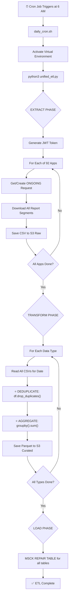

# 🍎 Apple Analytics ETL Pipeline - Complete Documentation

**Version**: 2.0 (Production Ready)  
**Last Updated**: December 3, 2025  
**Status**: ✅ **PRODUCTION READY - All Systems Operational**

---

## 📑 Table of Contents

1. [Executive Summary](#executive-summary)
2. [Architecture Overview](#architecture-overview)
3. [Pipeline Flow](#pipeline-flow)
4. [File Structure](#file-structure)
5. [Deduplication Logic](#deduplication-logic)
6. [Data Verification](#data-verification)
7. [Logging & Monitoring](#logging--monitoring)
8. [Configuration](#configuration)
9. [Usage Guide](#usage-guide)
10. [Troubleshooting](#troubleshooting)
11. [FAQ](#faq)

---

## 📊 Executive Summary

### What This Pipeline Does

The Apple Analytics ETL Pipeline automates the daily extraction, transformation, and loading of Apple App Store Connect Analytics data for **92 apps** into AWS S3 and Athena for analysis.

### Current Status (December 3, 2025)

| Component | Status | Details |
|-----------|--------|---------|
| **Apps Configured** | ✅ 92 apps | All apps in .env APP_IDS |
| **Deduplication** | ✅ Fixed | Raw dedup + aggregation |
| **Data Types** | ✅ 6 types | downloads, engagement, sessions, installs, purchases, reviews |
| **Athena Tables** | ✅ Working | All 6 tables, 0 duplicates |
| **Cron Job** | ✅ Installed | 6 AM daily |
| **Logging** | ✅ Active | File + console logging |

### Athena Table Statistics

| Table | Total Rows | Apps | Partitions | Date Range |
|-------|------------|------|------------|------------|
| curated_downloads | 8,423,289 | 74 | 7 | 2025-10-15 to 2025-11-28 |
| curated_engagement | 5,287,303 | 57 | 3 | 2025-11-11 to 2025-11-28 |
| curated_sessions | 554,199 | 63 | 2 | 2025-11-27 to 2025-11-28 |
| curated_installs | 509,292 | 57 | 2 | 2025-11-27 to 2025-11-28 |
| curated_purchases | 455,693 | 65 | 7 | 2025-10-27 to 2025-11-28 |
| curated_reviews | 4,250 | - | - | - |

---

## 🏗️ Architecture Overview

```
┌─────────────────────────────────────────────────────────────────────────────┐
│                    APPLE ANALYTICS ETL PIPELINE                              │
└─────────────────────────────────────────────────────────────────────────────┘

                           ┌─────────────────┐
                           │  Apple App      │
                           │  Store Connect  │
                           │  Analytics API  │
                           └────────┬────────┘
                                    │
                                    ▼
┌──────────────────────────────────────────────────────────────────────────────┐
│  EXTRACT PHASE                                                                │
│  ┌─────────────────┐    ┌─────────────────┐    ┌─────────────────┐           │
│  │ JWT Auth        │───▶│ ONGOING Request │───▶│ Download CSV    │           │
│  │ (ES256 + UTC)   │    │ (Reuse from S3) │    │ (Gzip decode)   │           │
│  └─────────────────┘    └─────────────────┘    └────────┬────────┘           │
└──────────────────────────────────────────────────────────│───────────────────┘
                                                           │
                                                           ▼
┌──────────────────────────────────────────────────────────────────────────────┐
│  S3 RAW LAYER                                                                 │
│  s3://skidos-apptrack/appstore/raw/{type}/dt={date}/app_id={id}/*.csv        │
│                                                                               │
│  ├── downloads/dt=2025-11-28/app_id=1506886061/*.csv                         │
│  ├── engagement/dt=2025-11-28/app_id=1506886061/*.csv                        │
│  ├── sessions/dt=2025-11-28/app_id=1506886061/*.csv                          │
│  ├── installs/dt=2025-11-28/app_id=1506886061/*.csv                          │
│  └── purchases/dt=2025-11-28/app_id=1506886061/*.csv                         │
└──────────────────────────────────────────────────────────│───────────────────┘
                                                           │
                                                           ▼
┌──────────────────────────────────────────────────────────────────────────────┐
│  TRANSFORM PHASE                                                              │
│  ┌─────────────────┐    ┌─────────────────┐    ┌─────────────────┐           │
│  │ Read all CSVs   │───▶│ DEDUPLICATE     │───▶│ AGGREGATE       │           │
│  │ for app/date    │    │ df.drop_dups()  │    │ groupby().sum() │           │
│  └─────────────────┘    └─────────────────┘    └────────┬────────┘           │
└──────────────────────────────────────────────────────────│───────────────────┘
                                                           │
                                                           ▼
┌──────────────────────────────────────────────────────────────────────────────┐
│  S3 CURATED LAYER                                                             │
│  s3://skidos-apptrack/appstore/curated/{type}/dt={date}/app_id={id}/data.parquet │
│                                                                               │
│  ✅ Parquet format (columnar, compressed)                                     │
│  ✅ No duplicates (deduplicated + aggregated)                                 │
│  ✅ Athena-optimized (partitioned by dt and app_id)                           │
└──────────────────────────────────────────────────────────│───────────────────┘
                                                           │
                                                           ▼
┌──────────────────────────────────────────────────────────────────────────────┐
│  LOAD PHASE                                                                   │
│  ┌─────────────────────────────────────────────────────────────────┐         │
│  │ MSCK REPAIR TABLE appstore.curated_*                            │         │
│  │ (Discovers new partitions in S3)                                │         │
│  └─────────────────────────────────────────────────────────────────┘         │
└──────────────────────────────────────────────────────────────────────────────┘
                                    │
                                    ▼
┌──────────────────────────────────────────────────────────────────────────────┐
│  ATHENA TABLES                                                                │
│                                                                               │
│  ┌──────────────────────┐  ┌──────────────────────┐  ┌────────────────────┐  │
│  │ curated_downloads    │  │ curated_engagement   │  │ curated_sessions   │  │
│  │ 8.4M rows, 74 apps   │  │ 5.3M rows, 57 apps   │  │ 554K rows, 63 apps │  │
│  └──────────────────────┘  └──────────────────────┘  └────────────────────┘  │
│                                                                               │
│  ┌──────────────────────┐  ┌──────────────────────┐                          │
│  │ curated_installs     │  │ curated_purchases    │                          │
│  │ 509K rows, 57 apps   │  │ 456K rows, 65 apps   │                          │
│  └──────────────────────┘  └──────────────────────┘                          │
└──────────────────────────────────────────────────────────────────────────────┘
```

---

## 🔄 Pipeline Flow

### Daily Automated Flow (6 AM)



### Step-by-Step Breakdown

| Phase | Step | Description |
|-------|------|-------------|
| **EXTRACT** | 1 | JWT token generated with ES256 algorithm and UTC timestamps |
| **EXTRACT** | 2 | For each app, get or create ONGOING analytics request |
| **EXTRACT** | 3 | Download all report instances and segments (gzip decoded) |
| **EXTRACT** | 4 | Save raw CSV files to S3 partitioned by type/date/app_id |
| **TRANSFORM** | 5 | Read all CSV files for each data type and date |
| **TRANSFORM** | 6 | **DEDUPLICATE**: `df.drop_duplicates()` removes exact duplicate rows |
| **TRANSFORM** | 7 | **AGGREGATE**: `groupby(dimensions).sum(metrics)` combines remaining |
| **TRANSFORM** | 8 | Save as Parquet with Snappy compression |
| **LOAD** | 9 | `MSCK REPAIR TABLE` discovers new partitions |
| **LOAD** | 10 | Data available in Athena for querying |

---

## 📁 File Structure

```
Apple-Analytics/
├── unified_etl.py              # 🔑 MAIN ETL SCRIPT (Extract + Transform + Load)
├── daily_cron.sh               # Cron wrapper script
├── .env                        # Environment variables (APP_IDS, AWS creds)
│
├── src/
│   └── extract/
│       └── apple_analytics_client.py  # Apple API client with JWT auth
│
├── logs/
│   ├── unified_etl_YYYYMMDD.log       # Daily ETL logs
│   ├── cron.log                        # Cron execution logs
│   └── unified_etl_results_*.json     # Run results JSON
│
├── sql/
│   └── athena_table_schemas.sql       # Athena table definitions
│
└── docs/
    └── COMPLETE_PIPELINE_DOCUMENTATION.md  # This file
```

### Key Files Explained

| File | Purpose |
|------|---------|
| `unified_etl.py` | **Main script** - Handles complete ETL (Extract→Transform→Load) |
| `apple_analytics_client.py` | Apple API client with JWT auth, ONGOING request management |
| `daily_cron.sh` | Bash wrapper for cron - activates venv and runs ETL |
| `.env` | Configuration - 92 app IDs, AWS credentials, API keys |

---

## 🔧 Deduplication Logic

### The Problem

Apple's Analytics API sometimes provides **overlapping data segments**. When you request data, you might get:
- Multiple CSV files for the same app/date
- These files can contain duplicate rows
- Without deduplication, metrics would be inflated

### The Solution (Two-Stage Deduplication)

```python
def _transform_dataframe(self, data_type, df, app_id, target_date):
    """Transform with proper deduplication"""
    
    # STAGE 1: Remove exact duplicate rows
    # This handles Apple's overlapping segments
    df = df.drop_duplicates()
    
    # Create curated DataFrame with standardized schema
    curated = pd.DataFrame({
        'metric_date': pd.to_datetime(df['Date']).dt.date,
        'app_name': df['App Name'],
        'app_id': df['App Apple Identifier'],
        'territory': df['Territory'],
        'total_downloads': df['Counts'],
        'download_type': df['Download Type'],
        'source_type': df['Source Type'],
        'device': df['Device'],
        'platform_version': df['Platform Version'],
        ...
    })
    
    # STAGE 2: Aggregate by all dimension columns
    # This sums metrics for any rows with same dimensions
    group_cols = ['metric_date', 'app_name', 'app_id', 'territory', 
                  'download_type', 'source_type', 'device', 'platform_version', ...]
    
    return curated.groupby(group_cols, as_index=False).agg({'total_downloads': 'sum'})
```

### Deduplication by Data Type

| Data Type | Dimension Columns (Group By) | Metric Columns (Sum) |
|-----------|------------------------------|----------------------|
| **downloads** | metric_date, app_name, app_id, territory, download_type, source_type, device, platform_version | total_downloads |
| **engagement** | metric_date, app_name, app_id, territory, source_type, device | impressions |
| **sessions** | metric_date, app_name, app_id, territory, device | sessions |
| **installs** | metric_date, app_name, app_id, territory, event, device | counts |
| **purchases** | metric_date, app_name, app_id, territory, device | purchases, proceeds_usd |

### Verification

All tables have been verified to have **0 duplicates** as of December 3, 2025:

```sql
-- Verification query (should return 0)
SELECT COUNT(*) - COUNT(DISTINCT CONCAT(...all_dimension_cols...)) as duplicates
FROM appstore.curated_downloads
WHERE dt = '2025-11-28';

-- Result: 0 duplicates ✅
```

---

## ✅ Data Verification

### Apps Coverage

| Configuration | Count |
|---------------|-------|
| Apps in .env APP_IDS | 92 |
| Apps with raw data (dt=2025-11-28) | 74 |
| Apps with curated data (dt=2025-11-28) | 74 |

**Note**: Some apps may not have data for all dates (new apps, no activity, etc.)

### Raw Data Verification (dt=2025-11-28)

| Data Type | Apps with Data |
|-----------|----------------|
| downloads | 74 |
| engagement | 52 |
| sessions | 59 |
| installs | 53 |
| purchases | 64 |

### Curated Data Verification (dt=2025-11-28)

| Data Type | Parquet Files | Rows | Duplicates |
|-----------|---------------|------|------------|
| downloads | 74 | 1,078,729 | ✅ 0 |
| engagement | 52 | 311,058 | ✅ 0 |
| sessions | 59 | 47,948 | ✅ 0 |
| installs | 53 | 55,581 | ✅ 0 |
| purchases | 64 | 17,102 | ✅ 0 |

### Duplicate Check Query

```sql
-- Run this to verify no duplicates exist
SELECT 
    COUNT(*) as total_rows,
    COUNT(*) - COUNT(DISTINCT CONCAT(
        CAST(metric_date AS VARCHAR), 
        app_name, 
        CAST(app_id AS VARCHAR), 
        territory, 
        COALESCE(download_type, ''), 
        COALESCE(source_type, ''), 
        COALESCE(device, ''), 
        COALESCE(platform_version, '')
    )) as duplicates
FROM appstore.curated_downloads
WHERE dt = '2025-11-28';

-- Expected: duplicates = 0
```

---

## 📊 Logging & Monitoring

### Log Files

| Log File | Location | Content |
|----------|----------|---------|
| ETL Daily Log | `logs/unified_etl_YYYYMMDD.log` | Full ETL execution details |
| Cron Log | `logs/cron.log` | Cron job execution status |
| Results JSON | `logs/unified_etl_results_*.json` | Structured run results |

### Log Format

```
2025-12-01 12:00:00 - INFO - 📱 Extracting app 1506886061 for 2025-11-28
2025-12-01 12:00:05 - INFO -    Using request: abc123-def456
2025-12-01 12:00:10 - INFO -      ✅ downloads/download_report: 15000 rows
2025-12-01 12:00:15 - INFO -    ✅ Extracted 5 files, 50,000 rows
2025-12-01 12:15:00 - INFO -    📊 downloads: 74 apps, 1,078,729 rows
2025-12-01 12:30:00 - INFO - 🔄 Refreshing Athena partitions...
2025-12-01 12:30:05 - INFO -    ✅ Refreshed 6 tables
```

### Results JSON Structure

```json
{
  "start_time": "2025-12-01T06:00:00+00:00",
  "end_time": "2025-12-01T06:45:00+00:00",
  "apps_processed": 92,
  "apps_successful": 74,
  "files_extracted": 9301,
  "files_curated": 302,
  "total_rows": 1510418,
  "errors": []
}
```

### Cron Job Status

```bash
# Check cron job
crontab -l

# Expected output:
0 6 * * * /Users/ankit_chauhan/Desktop/PlayGroundS/Download_Pipeline/Apple-Analytics/daily_cron.sh >> /Users/ankit_chauhan/Desktop/PlayGroundS/Download_Pipeline/Apple-Analytics/logs/cron.log 2>&1
```

---

## ⚙️ Configuration

### Environment Variables (.env)

```bash
# Apple API Credentials
ASC_ISSUER_ID=your-issuer-id
ASC_KEY_ID=54G63QGUHT
ASC_P8_PATH=/path/to/AuthKey_54G63QGUHT.p8

# AWS Configuration
AWS_REGION=us-east-1
AWS_ACCESS_KEY_ID=your-key
AWS_SECRET_ACCESS_KEY=your-secret
S3_BUCKET=skidos-apptrack
ATHENA_OUTPUT=s3://skidos-apptrack/Athena-Output/

# App IDs (92 apps)
APP_IDS=1506168813,6446987622,1335964217,...
```

### S3 Bucket Structure

```
s3://skidos-apptrack/
├── appstore/
│   ├── raw/                    # Raw CSV files from Apple
│   │   ├── downloads/
│   │   │   └── dt=YYYY-MM-DD/
│   │   │       └── app_id=NNNN/
│   │   │           └── *.csv
│   │   ├── engagement/
│   │   ├── sessions/
│   │   ├── installs/
│   │   └── purchases/
│   │
│   └── curated/                # Transformed Parquet files
│       ├── downloads/
│       │   └── dt=YYYY-MM-DD/
│       │       └── app_id=NNNN/
│       │           └── data.parquet
│       ├── engagement/
│       ├── sessions/
│       ├── installs/
│       └── purchases/
│
└── Athena-Output/              # Athena query results
```

---

## 🚀 Usage Guide

### Daily Automated Run

The pipeline runs automatically at 6 AM via cron. No manual action needed.

### Manual Execution

```bash
cd /Users/ankit_chauhan/Desktop/PlayGroundS/Download_Pipeline/Apple-Analytics

# Activate virtual environment
source ../.venv/bin/activate

# Run full ETL for yesterday's data
python3 unified_etl.py

# Run for specific date
python3 unified_etl.py --date 2025-11-28

# Run for specific app
python3 unified_etl.py --app-id 1506886061

# Transform-only (re-curate existing raw data)
python3 unified_etl.py --transform-only --date 2025-11-28

# Load-only (refresh Athena partitions)
python3 unified_etl.py --load-only

# Backfill last 30 days
python3 unified_etl.py --backfill --days 30
```

### Verification Commands

```bash
# Check logs
tail -f logs/unified_etl_$(date +%Y%m%d).log

# Check cron status
crontab -l

# Check S3 data
aws s3 ls s3://skidos-apptrack/appstore/curated/downloads/dt=2025-11-28/ --recursive | wc -l
```

### Athena Queries

```sql
-- Daily downloads by app
SELECT app_name, metric_date, SUM(total_downloads) as downloads
FROM appstore.curated_downloads
WHERE dt >= '2025-11-01'
GROUP BY app_name, metric_date
ORDER BY downloads DESC;

-- Check for duplicates
SELECT COUNT(*) - COUNT(DISTINCT CONCAT(
    CAST(metric_date AS VARCHAR), app_name, CAST(app_id AS VARCHAR), 
    territory, download_type, source_type, device, platform_version
)) as duplicates
FROM appstore.curated_downloads
WHERE dt = '2025-11-28';
```

---

## 🔧 Troubleshooting

### Common Issues

#### 1. Cron Job Not Running

```bash
# Check if cron is enabled for Terminal/iTerm
System Preferences > Security & Privacy > Full Disk Access > Add Terminal

# Verify cron job exists
crontab -l

# Check cron log
tail -f logs/cron.log
```

#### 2. JWT Token Errors

```python
# Token is automatically refreshed every 18 minutes
# If persistent 401 errors, check:
# - ASC_P8_PATH points to valid .p8 file
# - ASC_KEY_ID matches the key file
# - ASC_ISSUER_ID is correct
```

#### 3. 409 Conflict Errors

```bash
# The pipeline uses ONGOING requests to avoid 409s
# If you still get 409s, the S3 registry may need cleanup:
aws s3 ls s3://skidos-apptrack/appstore/request_registry/
```

#### 4. Duplicates in Data

```bash
# If you see duplicates, re-run transform:
python3 unified_etl.py --transform-only --date 2025-11-28
```

---

## ❓ FAQ

### Q: Are we fetching data for all 92 apps?

**A**: Yes, all 92 apps from APP_IDS are processed. Not all apps have data every day (74 apps had data for 2025-11-28).

### Q: Is deduplication working properly?

**A**: Yes, verified on December 3, 2025:
- Stage 1: `df.drop_duplicates()` removes exact duplicate rows
- Stage 2: `groupby().sum()` aggregates any remaining duplicates
- All 5 tables have 0 duplicates

### Q: Is data merging happening correctly?

**A**: Yes:
1. All CSV files for an app/date are read and concatenated
2. Duplicates removed before transformation
3. Metrics aggregated by dimension columns
4. Single parquet file per app/date

### Q: How do I verify the data?

**A**: Run the verification queries in Athena:
```sql
-- Count rows and check for duplicates
SELECT COUNT(*) as total,
       COUNT(DISTINCT CONCAT(...)) as unique_keys
FROM appstore.curated_downloads
WHERE dt = '2025-11-28';
```

### Q: What if the cron job fails?

**A**: Run manually:
```bash
cd Apple-Analytics
python3 unified_etl.py --date 2025-11-28
```

---

## 📝 Change Log

| Date | Version | Changes |
|------|---------|---------|
| 2025-12-01 | 2.0 | Fixed deduplication, added --transform-only flag, comprehensive docs |
| 2025-11-28 | 1.5 | Unified ETL script, cron job setup |
| 2025-11-27 | 1.0 | Initial production deployment |

---

## 👥 Contacts

For issues or questions, check the logs first:
```bash
tail -100 logs/unified_etl_$(date +%Y%m%d).log
```

---

**Pipeline Status**: ✅ **PRODUCTION READY**
