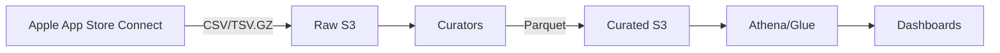
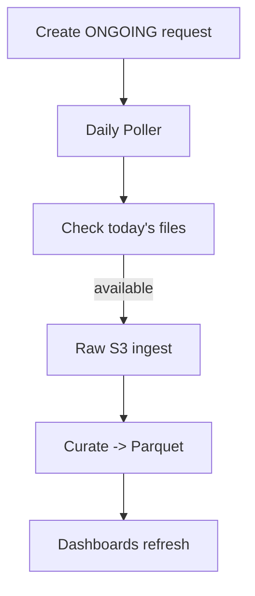
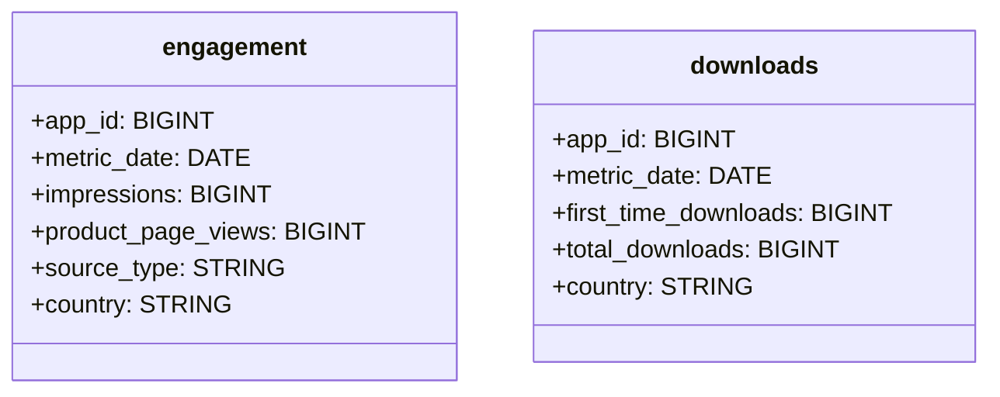

# Apple Analytics ETL Pipeline

> **Last Updated:** 2025-11-28  
> **Status:** ✅ Production Ready

A complete ETL pipeline for extracting Apple App Store Connect Analytics data and loading it into AWS Athena for business intelligence and dashboards.

---

## Table of Contents

1. [Quick Start](#quick-start)
2. [Architecture Overview](#architecture-overview)
3. [Implementation Status](#implementation-status)
4. [Project Structure](#project-structure)
5. [Data Flow](#data-flow)
6. [Usage Guide](#usage-guide)
7. [Athena Tables](#athena-tables)
8. [Configuration](#configuration)
9. [Troubleshooting](#troubleshooting)

---

## Quick Start

```bash
# 1. Activate virtual environment
cd /Users/ankit_chauhan/Desktop/PlayGroundS/Download_Pipeline/Apple-Analytics
source ../.venv/bin/activate

# 2. Run daily ETL (extracts yesterday's data)
python3 daily_etl.py

# 3. Or run for a specific app/date
python3 daily_etl.py --app-id 1506886061 --date 2025-11-26
```

---

## Architecture Overview

```
┌─────────────────────────────────────────────────────────────────────────────┐
│                        APPLE ANALYTICS ETL PIPELINE                         │
├─────────────────────────────────────────────────────────────────────────────┤
│                                                                             │
│  ┌──────────────┐    ┌──────────────┐    ┌──────────────┐    ┌───────────┐ │
│  │ Apple API    │───▶│ Extract      │───▶│ Transform    │───▶│ Load      │ │
│  │ (ASC)        │    │ (Raw → S3)   │    │ (Curate)     │    │ (Athena)  │ │
│  └──────────────┘    └──────────────┘    └──────────────┘    └───────────┘ │
│         │                   │                   │                   │       │
│         ▼                   ▼                   ▼                   ▼       │
│  ┌──────────────┐    ┌──────────────┐    ┌──────────────┐    ┌───────────┐ │
│  │ Analytics    │    │ s3://bucket/ │    │ s3://bucket/ │    │ Athena    │ │
│  │ Sales API    │    │ appstore/raw │    │ appstore/    │    │ Tables    │ │
│  │ Reviews API  │    │              │    │ curated/     │    │           │ │
│  └──────────────┘    └──────────────┘    └──────────────┘    └───────────┘ │
│                                                                             │
└─────────────────────────────────────────────────────────────────────────────┘
```

---

## Implementation Status

### ✅ Implemented Features

| Feature | Status | File |
|---------|--------|------|
| **ONGOING Request Support** | ✅ Done | `src/extract/apple_analytics_client.py` |
| **ONE_TIME_SNAPSHOT Backfill** | ✅ Done | `src/extract/apple_analytics_client.py` |
| **S3 Registry (avoid 409s)** | ✅ Done | `src/extract/apple_analytics_client.py` |
| **Daily ETL Script** | ✅ Done | `daily_etl.py` |
| **Downloads Extraction** | ✅ Done | `src/extract/focused_data_extractor.py` |
| **Engagement Extraction** | ✅ Done | `src/extract/focused_data_extractor.py` |
| **Sales & Trends API** | ✅ Done | `src/extract/apple_analytics_client.py` |
| **Data Curation (Parquet)** | ✅ Done | `src/transform/apple_analytics_data_curator_production.py` |
| **Athena Table Manager** | ✅ Done | `src/load/athena_table_manager_production.py` |
| **JWT Auto-Refresh** | ✅ Done | `src/extract/apple_analytics_client.py` |
| **Error Handling & Retry** | ✅ Done | All modules |

### 📊 Data Available in Athena

| Database | Table | Rows | Status |
|----------|-------|------|--------|
| `appstore` | `appstore_downloads` | 17M+ | ✅ Fresh |
| `appstore` | `appstore_engagement` | 29M+ | ✅ Fresh |
| `appstore` | `raw_installs` | Available | ✅ |
| `appstore` | `raw_sessions` | Available | ✅ |
| `appstore` | `raw_purchases` | Available | ✅ |
| `curated` | `downloads` | Available | ✅ |
| `curated` | `engagement` | Available | ✅ |
| `curated` | `purchases` | Available | ✅ |
| `curated` | `search_terms` | Available | ✅ |
| `curated` | `deletions` | Available | ✅ |

### 🔄 Planned But Not Yet Implemented

| Feature | Status | Notes |
|---------|--------|-------|
| Reviews Sentiment Analysis | ⏳ Planned | Topic clustering needed |
| QuickSight Dashboard | ⏳ Planned | Can use Athena directly |
| Alerting (Stale Data) | ⏳ Planned | CloudWatch integration |
| Airflow DAG Integration | ✅ Ready | `airflow/dags/apple_ingestion.py` exists |

---

## Project Structure

```
Apple-Analytics/
├── daily_etl.py                 # 🚀 Main daily ETL script (ONGOING requests)
├── run_daily_etl.sh             # Shell wrapper for cron jobs
├── production_manager.py        # Production orchestration
├── complete_etl_health_check.py # Health check script
│
├── src/
│   ├── extract/
│   │   ├── apple_analytics_client.py      # Apple API client (JWT, requests)
│   │   ├── focused_data_extractor.py      # Report extraction logic
│   │   └── apple_request_status_checker.py
│   │
│   ├── transform/
│   │   └── apple_analytics_data_curator_production.py  # CSV → Parquet
│   │
│   ├── load/
│   │   └── athena_table_manager_production.py  # Athena DDL management
│   │
│   └── orchestration/
│       └── unified_production_etl.py       # Full ETL orchestration
│
├── config/                      # Configuration templates
├── logs/                        # ETL execution logs
├── data/                        # Local data cache
└── archive/                     # Old verification scripts
```

---

## Data Flow

### Daily ETL Flow (ONGOING Requests)

```
┌─────────────────────────────────────────────────────────────────┐
│                    Daily ETL Flow                               │
├─────────────────────────────────────────────────────────────────┤
│                                                                 │
│  1. Check S3 Registry for existing ONGOING request              │
│     └── s3://skidos-apptrack/analytics_requests/registry/       │
│                                                                 │
│  2. If not found → Query Apple API                              │
│     └── GET /apps/{app_id}/analyticsReportRequests              │
│         ?filter[accessType]=ONGOING                             │
│                                                                 │
│  3. If still not found → Create new ONGOING request             │
│     └── POST /analyticsReportRequests                           │
│         {"accessType": "ONGOING"}                               │
│                                                                 │
│  4. Save request_id to S3 registry for next time                │
│                                                                 │
│  5. Traverse: Reports → Instances → Segments → Files            │
│                                                                 │
│  6. Download CSV files to S3                                    │
│     └── s3://skidos-apptrack/appstore/raw/{type}/dt=.../        │
│                                                                 │
│  7. Transform to Parquet (optional)                             │
│     └── s3://skidos-apptrack/appstore/curated/{type}/           │
│                                                                 │
│  8. Query via Athena                                            │
│                                                                 │
└─────────────────────────────────────────────────────────────────┘
```

### S3 Directory Structure

```
s3://skidos-apptrack/
├── appstore/
│   ├── raw/
│   │   ├── downloads/dt=2025-11-27/app_id=1506886061/
│   │   ├── engagement/dt=2025-11-27/app_id=1506886061/
│   │   ├── installs/dt=2025-11-27/app_id=1506886061/
│   │   └── sessions/dt=2025-11-27/app_id=1506886061/
│   │
│   ├── raw_sales/SALES/DAILY/reportDate=2025-11-27/
│   │
│   └── curated/
│       ├── downloads/dt=2025-11-27/app_id=1506886061/
│       └── engagement/dt=2025-11-27/app_id=1506886061/
│
└── analytics_requests/
    └── registry/
        └── app_id=1506886061/
            └── ongoing.json   # Cached request ID
```

---

## Usage Guide

### Daily Automated Extraction

```bash
# Run for all apps (92 configured)
python3 daily_etl.py

# Run for specific app
python3 daily_etl.py --app-id 1506886061

# Run for specific date
python3 daily_etl.py --date 2025-11-26

# Via shell script (for cron)
./run_daily_etl.sh
```

### Cron Job Setup

```bash
# Add to crontab - runs at 4 PM UTC daily (after Apple data is available)
0 16 * * * cd /path/to/Apple-Analytics && ./run_daily_etl.sh >> /var/log/apple_etl.log 2>&1
```

### Health Check

```bash
python3 complete_etl_health_check.py
```

### Query Data in Athena

```sql
-- Check downloads for an app
SELECT metric_date, total_downloads, first_time_downloads
FROM appstore.appstore_downloads
WHERE app_apple_id = 1506886061
ORDER BY metric_date DESC
LIMIT 10;

-- Check engagement metrics
SELECT metric_date, impressions, product_page_views
FROM appstore.appstore_engagement
WHERE app_apple_id = 1506886061
ORDER BY metric_date DESC
LIMIT 10;
```

---

## Athena Tables

### Database: `appstore` (Raw Data)

| Table | Description | Key Columns |
|-------|-------------|-------------|
| `appstore_downloads` | Daily download metrics | `app_apple_id`, `metric_date`, `total_downloads`, `first_time_downloads` |
| `appstore_engagement` | Impressions & page views | `app_apple_id`, `metric_date`, `impressions`, `product_page_views` |
| `raw_installs` | Install/deletion events | `app_id`, `date`, `installs`, `deletions` |
| `raw_sessions` | App session metrics | `app_id`, `date`, `sessions`, `active_devices` |
| `raw_purchases` | In-app purchases | `app_id`, `sku`, `units`, `proceeds` |

### Database: `curated` (Processed Data)

| Table | Description | Key Columns |
|-------|-------------|-------------|
| `downloads` | Curated downloads | `app_id`, `metric_date`, `country`, `platform` |
| `engagement` | Curated engagement | `app_id`, `metric_date`, `source_type`, `page_type` |
| `purchases` | Curated purchases | `app_id`, `sku`, `report_date`, `units`, `revenue` |
| `search_terms` | ASO search data | `app_id`, `search_term`, `impressions` |
| `deletions` | App deletions | `app_id`, `metric_date`, `deletions` |

---

## Configuration

### Environment Variables (`.env`)

```bash
# Apple App Store Connect
ASC_ISSUER_ID=your-issuer-id
ASC_KEY_ID=your-key-id
ASC_P8_PATH=/path/to/AuthKey.p8

# Vendor & Apps
APPLE_VENDOR_NUMBER=85875515
APP_IDS=1506886061,1159612010,1468754350,...

# AWS
AWS_REGION=us-east-1
S3_BUCKET=skidos-apptrack
S3_PREFIX=appstore/

# Athena
GLUE_DB=appstore
ATHENA_WORKGROUP=primary
ATHENA_OUTPUT=s3://skidos-apptrack/Athena-Output/
```

### Apps Configured

Currently **92 apps** are configured in `APP_IDS`. Key apps include:
- `1506886061` - Doctor Games for Kids (17M+ downloads)
- `1159612010` - Another high-volume app
- `1468754350` - Chess for Kids

---

## Troubleshooting

### Common Issues

| Issue | Cause | Solution |
|-------|-------|----------|
| 409 Conflict | Request already exists | Use ONGOING requests (fixed!) |
| 401 Unauthorized | JWT expired | Auto-refresh handles this |
| 403 Forbidden | No permission to list requests | Registry fallback works |
| Timeout errors | Apple API slow | Increase timeout, retry |
| No data for date | Data not yet published | Apple publishes ~2 days late |

### Logs

```bash
# Check ETL logs
tail -f logs/daily_etl_*.log

# Check results
cat daily_etl_results_*.json
```

### Verify S3 Registry

```bash
aws s3 cat s3://skidos-apptrack/analytics_requests/registry/app_id=1506886061/ongoing.json
```

---

## Original Design Diagrams

<details>
<summary>Click to expand architecture diagrams</summary>

### System Overview


### ONGOING Daily Feed


### Data Model


</details>

---

## Contributing

1. Create feature branch
2. Make changes
3. Test with `python3 daily_etl.py --app-id 1506886061`
4. Verify data in Athena
5. Submit PR

---

## License

Internal use only - SKIDOS
