here’s a crisp set of **copy-pasteable flow charts** for everything we planned for the analytics dashboard—data in, curation, querying, and the business views.

---

## 1) System overview (context)

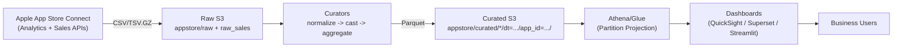

---

## 2) ONE_TIME backfill (historical) – request → poll → land

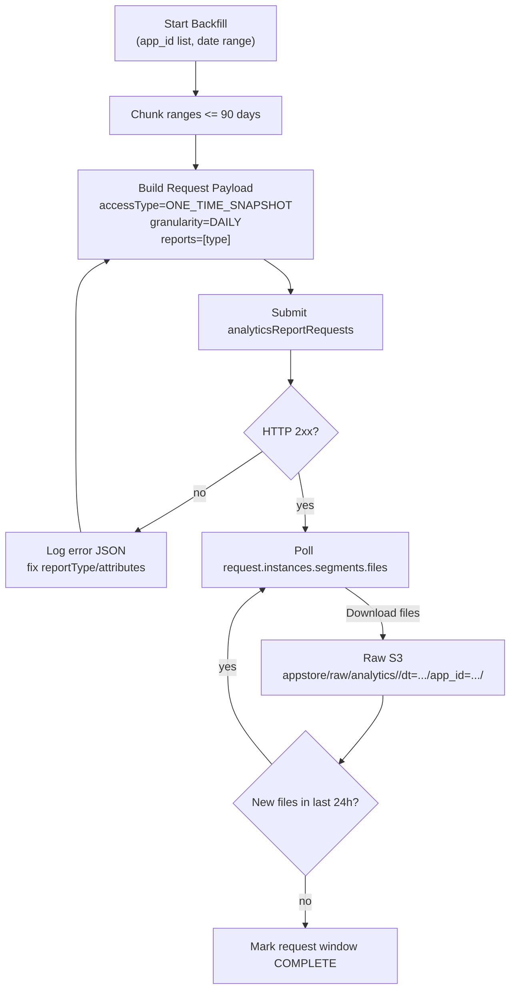

---

## 3) ONGOING daily feed – rolling updates

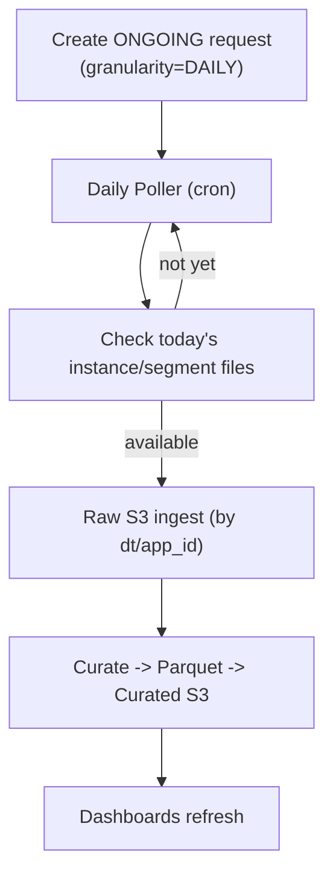

---

## 4) Sales & Trends (purchases/units) pipeline

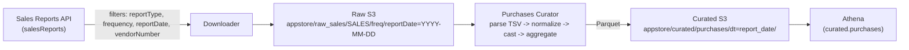

---

## 5) Curation flow (common pattern, all analytics tables)

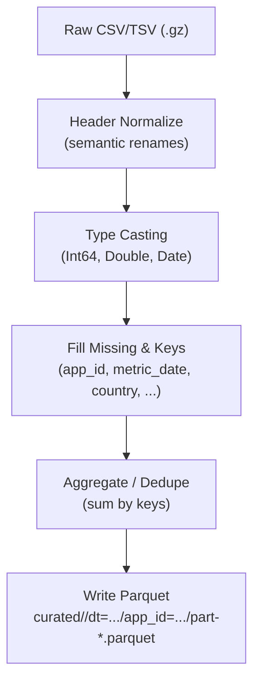

---

## 6) Athena readiness (projection + query hygiene)

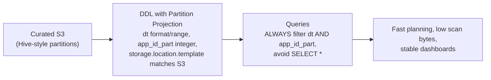

---

## 7) Dashboard UX flows (role-based)

### 7a) Executive Overview (5-second health)

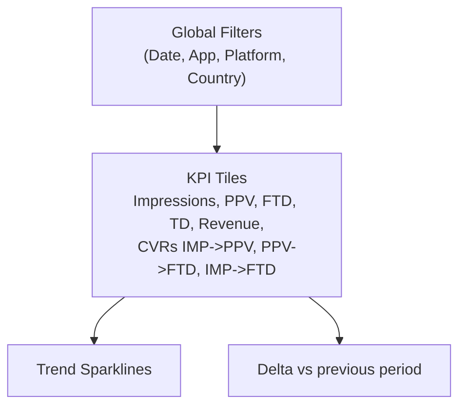

### 7b) Acquisition & ASO

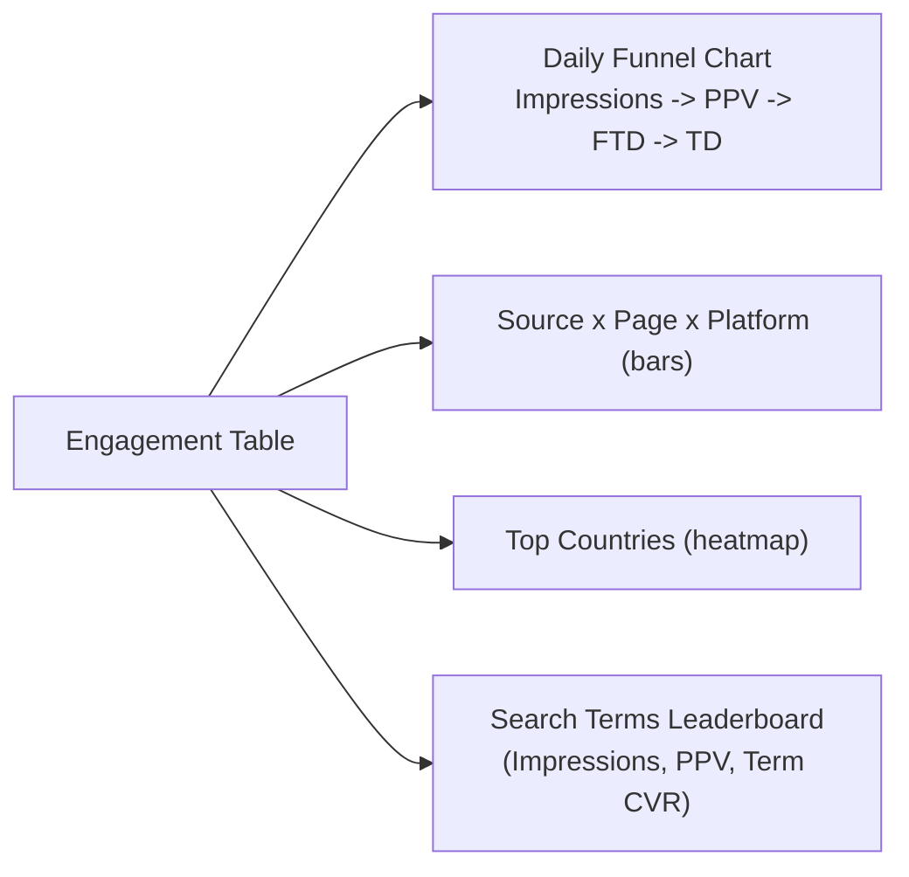

### 7c) Monetization

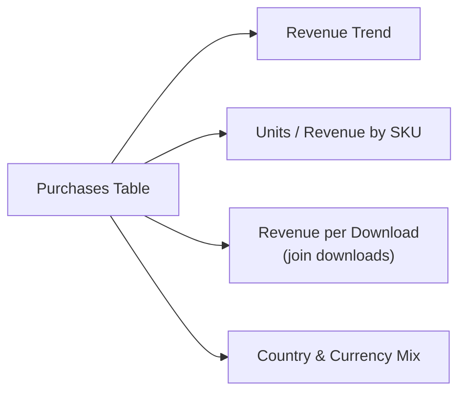

### 7d) Quality & Brand (Reviews)

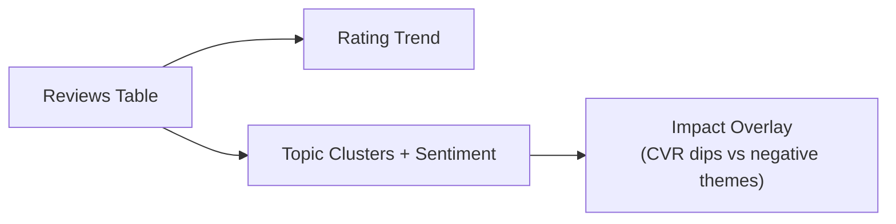

### 7e) Ops & Data Health

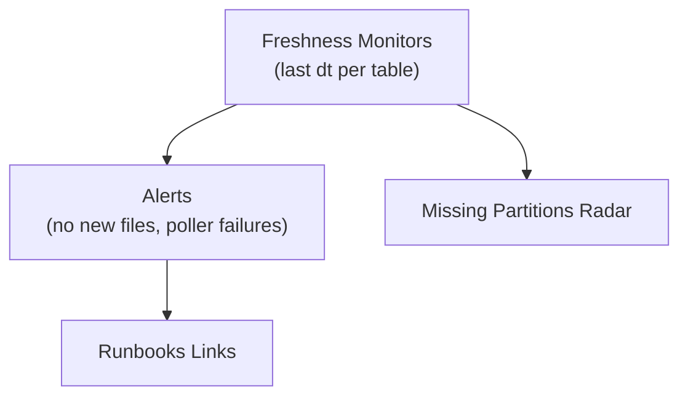

---

## 8) Drilldown navigation (from KPIs to root-cause)

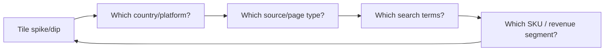

---

## 9) Data model map (high level)

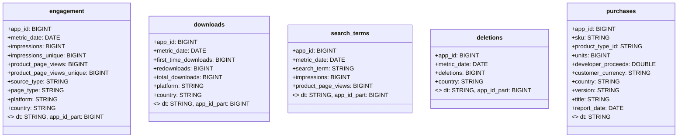

---

## 10) Error handling & SLAs (ops loop)

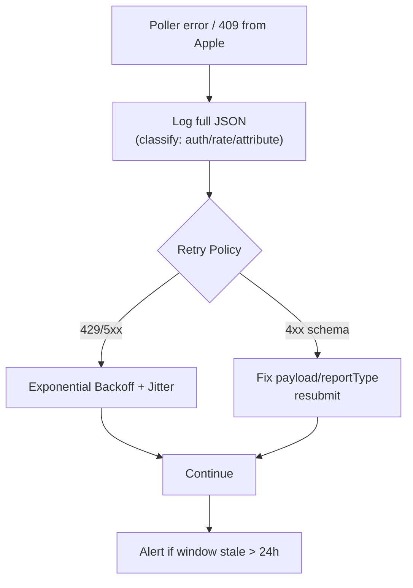

---

### That’s the whole picture

* You can drop these into your docs or PRDs as-is.
* If you want, I can generate a **single PDF** with all diagrams or a **README.md** that your team can commit to the repo.
